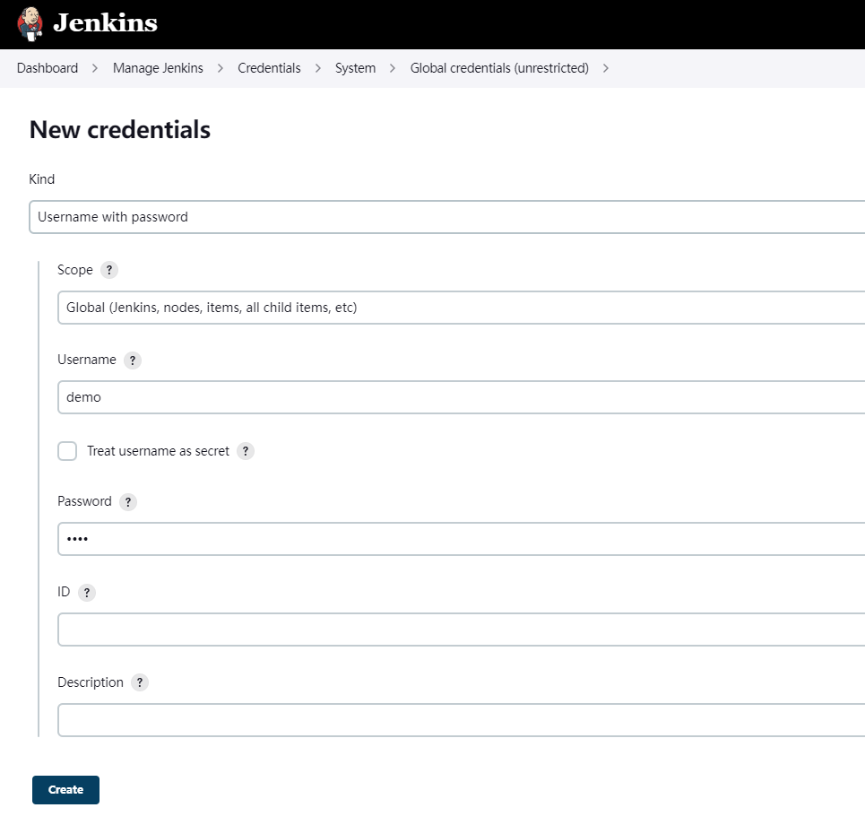
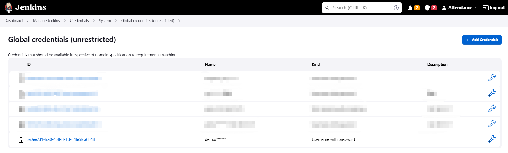

I was received a request yesterday, which is build a deploy process for frontend developer because of the bad office internet. here is some record about that solution.

## 1. Create ssh credential

first, we create a crediential with username demo and password demo, you can change the username and password in your real environment.



after click create button, we get a created random id `6a0ee231-fca0-46ff-8a1d-54fe5fca6b48`, shown as below. 



## 2. Use ssh pipeline to upload and deploy on the remote host

with this scripts, we can deploy front end project on the remote host.

```pipeline
pipeline {
    agent any

    tools {
        nodejs "node.v.16.15.1"
    }

    stages {
        stage('Build') {
            steps {
                // ... ...
                // build files are located on stage directory
            }
        }
        
        stage ('Remote SSH') {
            steps {
              withCredentials([usernamePassword(credentialsId: '6a0ee231-fca0-46ff-8a1d-54fe5fca6b48', usernameVariable: 'NUSER', passwordVariable: 'NPASS')]) {
                script {
                  def remote = [:]
                  remote.name = 'test'
                  remote.host = '127.0.0.2'
                  remote.user = NUSER
                  remote.password = NPASS
                  remote.allowAnyHosts = true

                  // the publish directory is already created at 127.0.0.2 host
                  sshPut remote: remote, from: "stage", into: "/home/publish"

                  // the demo is binded with docker container, we just need replace files inside it
                  sshCommand remote: remote, command: "rm -rf /home/demo/* && mv /home/publish/stage/* /home/demo/"
                }
              }
            }
        }
    }
}
```